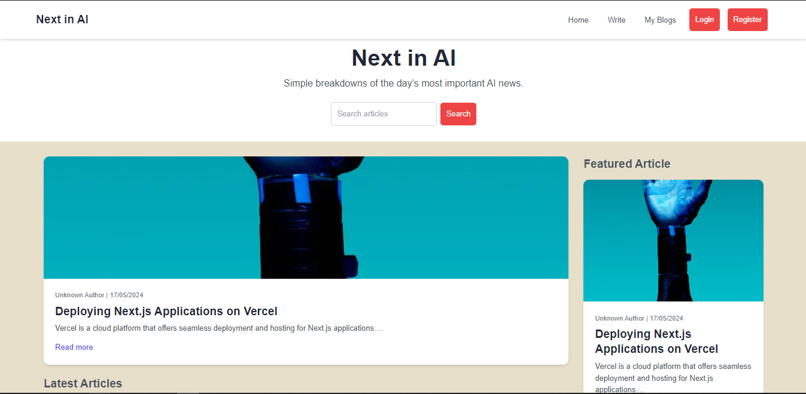
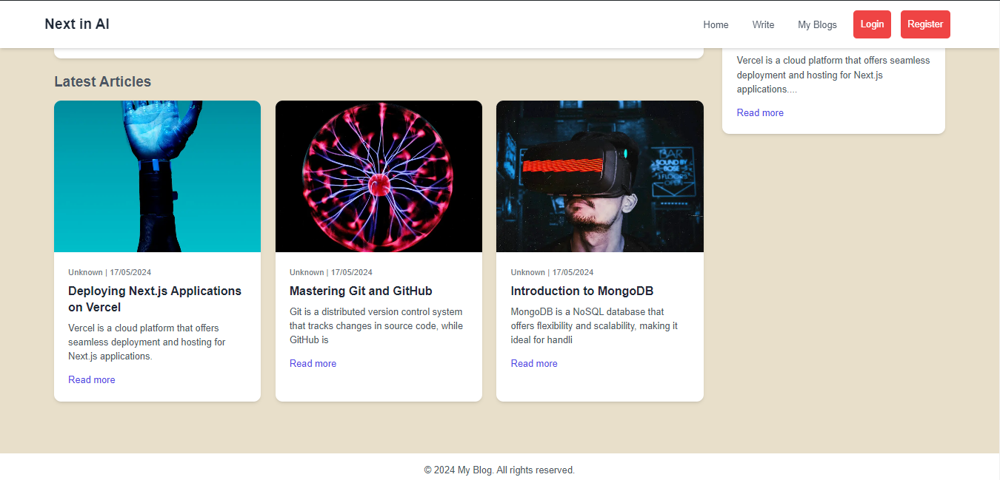
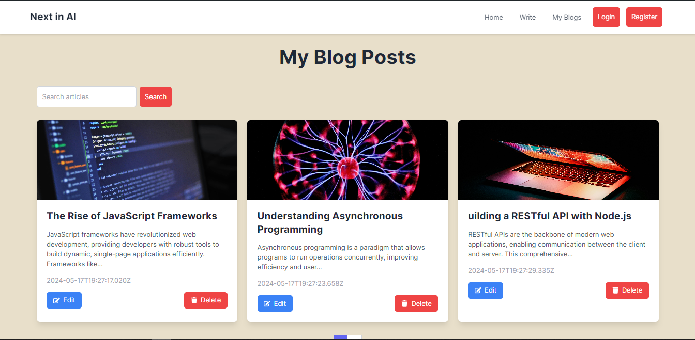
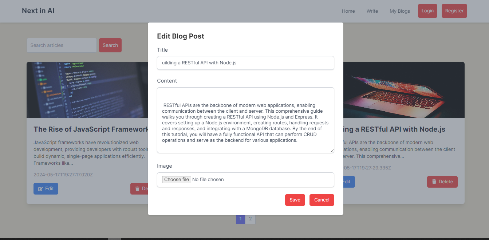
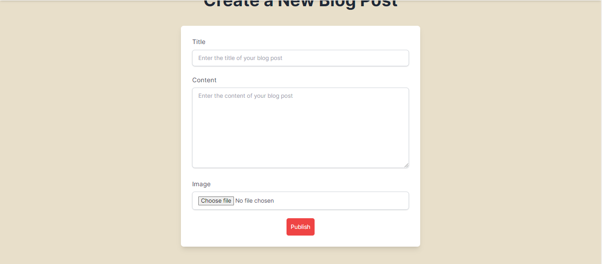

# Next.js Blog Post Project

This is a [Next.js](https://nextjs.org/) project bootstrapped with [`create-next-app`](https://github.com/vercel/next.js/tree/canary/packages/create-next-app).

## Project Overview

This project is a blog application where users can add, edit, and delete blog posts. It also supports image uploads for each blog post. The project uses Axios for making HTTP requests and MongoDB as the database.

## Getting Started

First, run the development server:

```bash
npm run dev
# or
yarn dev
# or
pnpm dev
# or
bun dev
```

Open [http://localhost:3000](http://localhost:3000) with your browser to see the result.

You can start editing the page by modifying `app/page.tsx`. The page auto-updates as you edit the file.

This project uses [`next/font`](https://nextjs.org/docs/basic-features/font-optimization) to automatically optimize and load Inter, a custom Google Font.

## Features

- Add new blog posts with image uploads
- Edit existing blog posts
- Delete blog posts
- View all blog posts
- Responsive design

### Screenshots

#### Home Page



#### My Blogs Page


#### Edit Post Page


#### Write Post Page



## Axios and MongoDB Integration

This project uses Axios for making HTTP requests and MongoDB for the database.

### Setting Up MongoDB

1. **Install MongoDB**: Follow the instructions on the [MongoDB installation page](https://docs.mongodb.com/manual/installation/) to install MongoDB on your machine.
2. **Start MongoDB**: Once installed, start the MongoDB server by running:
   ```bash
   mongod
   ```
3. **Create a Database**: Connect to your MongoDB server and create a new database for your project.
   ```bash
   mongo
   use mydatabase
   ```
4. **Set Up Environment Variables**: Add your MongoDB connection string to your `.env.local` file.
   ```env
   MONGODB_URI=mongodb://localhost:27017/mydatabase
   ```

### Using Axios

Axios is used for making HTTP requests to your API routes or external APIs.

1. **Install Axios**: Add Axios to your project by running:
   ```bash
   npm install axios
   ```
2. **Make a Request**: Use Axios in your components or API routes to make HTTP requests.
   ```javascript
   import axios from 'axios';

   const fetchData = async () => {
     const response = await axios.get('/api/posts');
     console.log(response.data);
   };
   ```

## Setting Up Jest in a Next.js TypeScript Project

To set up Jest for a Next.js project using TypeScript, follow these steps:

1. **Install Dependencies**: Install the necessary packages for Jest and TypeScript support.
   ```bash
   npm install --save-dev jest @types/jest ts-jest
   npm install --save-dev @testing-library/react @testing-library/jest-dom
   ```

2. **Configure Jest**: Create a `jest.config.js` file in the root of your project with the following content:
   ```javascript
   const nextJest = require('next/jest')

   const createJestConfig = nextJest({
     dir: './',
   })

   const customJestConfig = {
     setupFilesAfterEnv: ['<rootDir>/jest.setup.js'],
     moduleNameMapper: {
       '^@/components/(.*)$': '<rootDir>/components/$1',
     },
     testEnvironment: 'jsdom',
   }

   module.exports = createJestConfig(customJestConfig)
   ```

3. **Setup Jest**: Create a `jest.setup.js` file in the root of your project with the following content:
   ```javascript
   import '@testing-library/jest-dom/extend-expect'
   ```

4. **Add Scripts**: Update your `package.json` to include the Jest script.
   ```json
   "scripts": {
     "test": "jest"
   }
   ```

5. **Create Test Files**: Create test files with the `.test.tsx` or `.spec.tsx` extension.

6. **Run Tests**: Run your tests using the following command:
   ```bash
   npm test
   ```

## Learn More

To learn more about Next.js, take a look at the following resources:

- [Next.js Documentation](https://nextjs.org/docs) - learn about Next.js features and API.
- [Learn Next.js](https://nextjs.org/learn) - an interactive Next.js tutorial.

You can check out [the Next.js GitHub repository](https://github.com/vercel/next.js/) - your feedback and contributions are welcome!

## Deploy on Vercel

The easiest way to deploy your Next.js app is to use the [Vercel Platform](https://vercel.com/new?utm_medium=default-template&filter=next.js&utm_source=create-next-app&utm_campaign=create-next-app-readme) from the creators of Next.js.

Check out our [Next.js deployment documentation](https://nextjs.org/docs/deployment) for more details.


